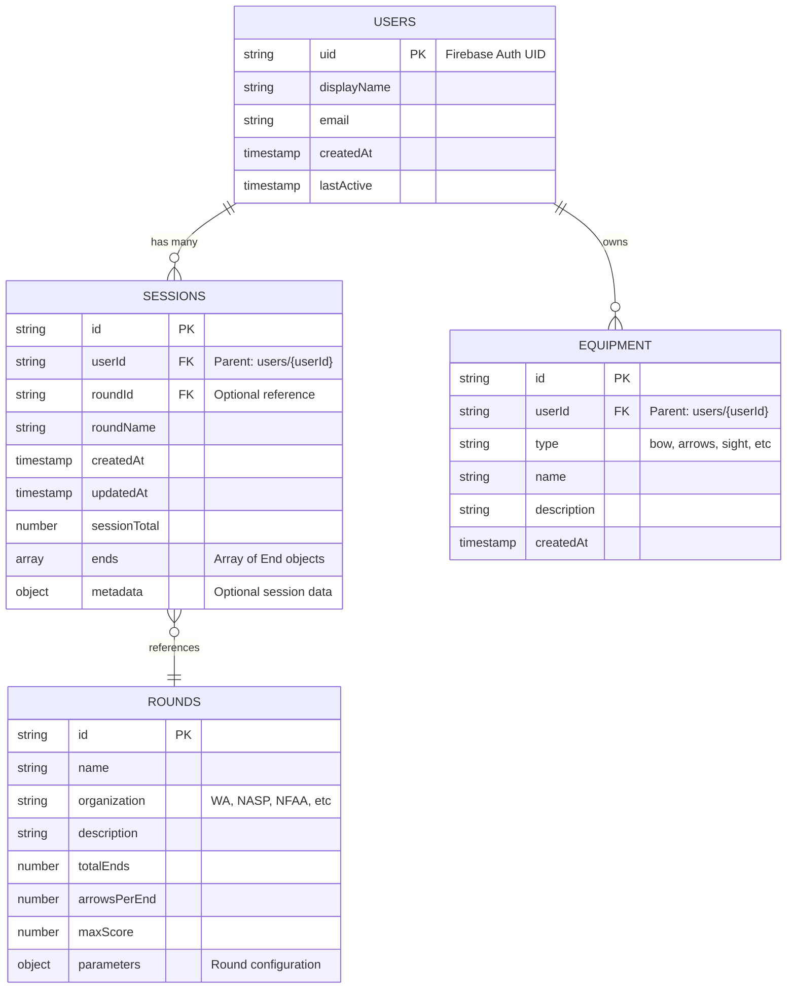

# Firestore Database Schema Diagram

This document provides a visual representation of the Firestore database schema for the Archery App.

## Entity Relationship Diagram



## Collection Hierarchy Diagram

```mermaid
graph TD
    Root[Firestore Root]
    
    Root --> Users[users collection]
    Root --> Rounds[rounds collection]
    
    Users --> User1[users/{userId}]
    User1 --> Sessions[sessions subcollection]
    User1 --> Equipment[equipment subcollection]
    
    Sessions --> Session1[sessions/{sessionId}]
    Equipment --> Equip1[equipment/{equipmentId}]
    
    Rounds --> Round1[rounds/{roundId}]
    
    Session1 -.reference.-> Round1
    
    style Users fill:#e1f5ff
    style Sessions fill:#e1f5ff
    style Equipment fill:#e1f5ff
    style Rounds fill:#ffe1e1
    style Root fill:#f0f0f0
```

## Data Flow Diagram

```mermaid
flowchart LR
    User[Authenticated User]
    App[Archery App]
    Auth[Firebase Auth]
    FS[Firestore]
    
    User -->|Login| Auth
    Auth -->|User ID| App
    
    App -->|Read| Rounds[(rounds collection)]
    App -->|Select Round| App
    
    App -->|Create Session| UserSessions[(users/{uid}/sessions)]
    App -->|Record Arrows| UserSessions
    App -->|Update Scores| UserSessions
    
    App -->|Manage Equipment| UserEquip[(users/{uid}/equipment)]
    
    UserSessions -.->|Reference| Rounds
    
    style Rounds fill:#ffe1e1
    style UserSessions fill:#e1f5ff
    style UserEquip fill:#e1f5ff
```

## Security Model

```mermaid
graph TB
    subgraph "Authenticated Users"
        U1[User A]
        U2[User B]
    end
    
    subgraph "Firestore Collections"
        subgraph "Private Data"
            S1[users/A/sessions]
            E1[users/A/equipment]
            S2[users/B/sessions]
            E2[users/B/equipment]
        end
        
        subgraph "Global Read-Only"
            R[rounds collection]
        end
    end
    
    U1 -->|Read/Write| S1
    U1 -->|Read/Write| E1
    U1 -->|Read Only| R
    U1 -.X.-|No Access| S2
    U1 -.X.-|No Access| E2
    
    U2 -->|Read/Write| S2
    U2 -->|Read/Write| E2
    U2 -->|Read Only| R
    U2 -.X.-|No Access| S1
    U2 -.X.-|No Access| E1
    
    Admin[Server/Admin] -->|Write| R
    
    style S1 fill:#e1f5ff
    style E1 fill:#e1f5ff
    style S2 fill:#e1f5ff
    style E2 fill:#e1f5ff
    style R fill:#ffe1e1
```

## Data Types

### Arrow Type
```typescript
type Arrow = number | 'X' | 'M' | null
// number: 0-10 (scoring zones)
// 'X': Inner 10 (bull's-eye)
// 'M': Miss
// null: Not yet scored
```

### End Object
```typescript
interface End {
  endNumber: number      // 1-indexed
  arrows: Arrow[]        // Array of arrow values
  endTotal: number       // Sum of arrow scores
}
```

### Round Distance
```typescript
interface RoundDistance {
  value: number          // Distance value
  unit: 'meters' | 'yards'
  ends: number           // Number of ends at this distance
}
```

## Access Patterns

### Common Read Operations
1. **List user's sessions** (sorted by date)
   - Path: `users/{userId}/sessions`
   - Query: `orderBy('createdAt', 'desc')`

2. **Get available rounds**
   - Path: `rounds`
   - Query: Optional filter by `organization`

3. **Get session details**
   - Path: `users/{userId}/sessions/{sessionId}`

4. **List user's equipment**
   - Path: `users/{userId}/equipment`

### Common Write Operations
1. **Create new session**
   - Path: `users/{userId}/sessions`
   - Method: `addDoc()` with session data

2. **Update session scores**
   - Path: `users/{userId}/sessions/{sessionId}`
   - Method: `updateDoc()` with updated ends and totals

3. **Add equipment**
   - Path: `users/{userId}/equipment`
   - Method: `addDoc()` with equipment data

## Indexes

Recommended composite indexes:

| Collection | Fields | Order |
|-----------|--------|-------|
| users/{userId}/sessions | createdAt | DESC |
| rounds | organization, name | ASC, ASC |

## Notes

- All timestamps use Firebase `serverTimestamp()` for consistency
- Session totals are calculated client-side and stored for performance
- Rounds collection is read-only for clients (admin writes only)
- User data is completely isolated by Firebase Auth UID
